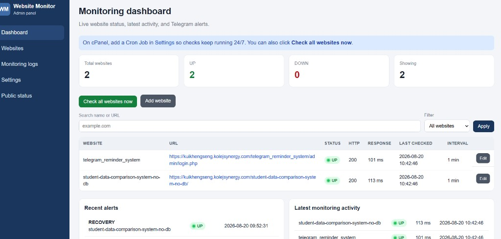
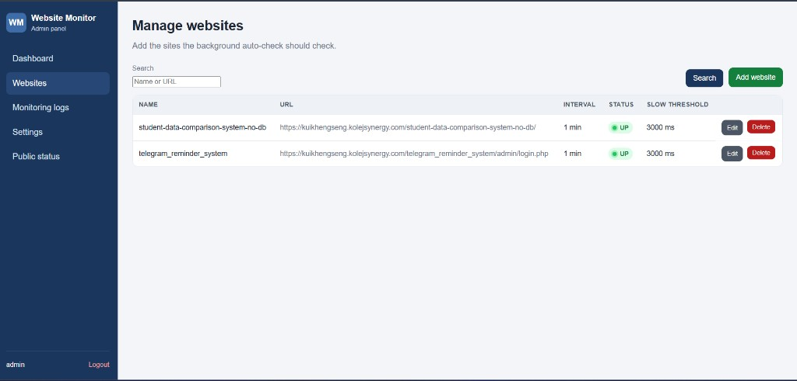
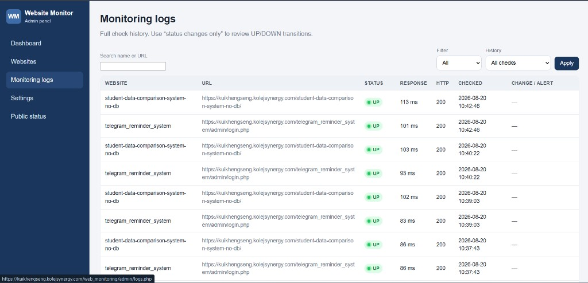
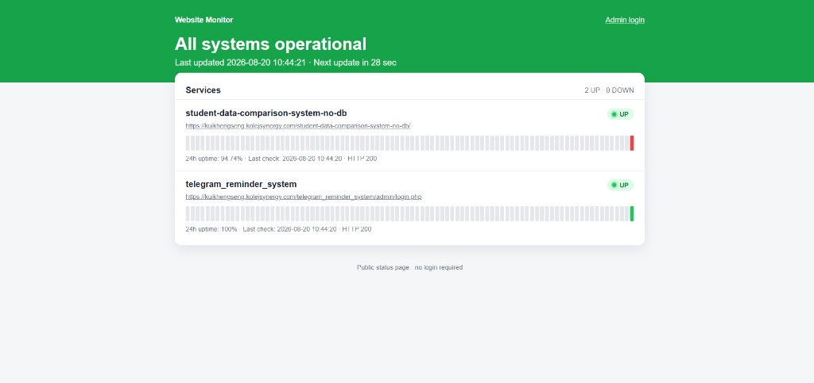

# Website Monitoring System with Telegram Alert (Admin Only)

Simple PHP + MySQL admin panel that checks websites, stores history, and sends Telegram messages when a site goes **DOWN**, comes back **UP**, or becomes **SLOW**.

No user registration. One admin account only.

## Screenshots

**Dashboard**



**Manage websites**



**Monitoring logs**



**Public status page**



## Folder structure

```
web_monitoring/
├── admin/                 Admin pages (login, dashboard, websites, logs, settings)
├── assets/css/            Styles
├── assets/js/             Show/hide password, delete confirm
├── config/                App settings (database.local.php is gitignored)
├── cron/monitor.php       Automatic monitoring engine
├── docs/screenshots/      README screenshots
├── includes/              Auth, Telegram, check logic, layout
├── sql/schema.sql         Database structure
└── index.php              Public status page
```

## XAMPP setup

1. Install [XAMPP](https://www.apachefriends.org/) and start **Apache** + **MySQL**.
2. Copy this project folder into:
   - `C:\xampp\htdocs\web_monitoring`
3. Open phpMyAdmin: `http://localhost/phpmyadmin`
4. Import `sql/schema.sql` (creates database `web_monitoring` and tables).
5. If your MySQL password is not empty, edit `config/database.php`.
6. Open: `http://localhost/web_monitoring/`
7. Log in:
   - Username: `admin`
   - Password: `admin123`
8. Change the password immediately (Settings, or Forgot password).

PHP **cURL** must be enabled (default in XAMPP). In `php.ini` confirm `extension=curl` is not commented out.

## First-time admin steps

1. **Settings** → paste Telegram bot token and chat ID → **Send test message**.
2. **Websites** → add name, URL (`https://...`), interval in minutes, optional slow threshold.
3. Dashboard → **Check all websites now** (does not wait for the next interval).
4. Keep the PHP server running locally, or add a cPanel Cron Job after upload.

Change `ADMIN_RESET_KEY` and `CRON_KEY` in `config/config.php`.

## Telegram bot setup

1. Open Telegram and search **@BotFather**.
2. Send `/newbot`, follow the prompts, copy the **bot token**.
3. Start a chat with your bot and send any message (for example `/start`).
4. Get your **chat ID**:
   - Open: `https://api.telegram.org/bot<YOUR_TOKEN>/getUpdates`
   - Find `"chat":{"id": 123456789}`
   - For a group, add the bot to the group, send a message, then read `getUpdates` again (group IDs are often negative).
5. Paste token and chat ID in **Admin → Settings** (or in `config/config.php`).

Alerts are sent **only when status changes** (or when a site first becomes slow). Repeated UP or repeated DOWN checks do not send another Telegram message.

Message examples:

```
ALERT: Website DOWN
Website: School portal
URL: https://example.com
Status: DOWN
Response time: N/A
Time: 2026-08-19 15:00:00
```

```
RECOVERY: Website back UP
...
```

```
WARNING: Slow response detected
...
```

## How monitoring works

`cron/monitor.php` loads websites whose `last_checked` is older than their interval (or never checked).

For each URL it:

1. Sends an HTTP request with cURL
2. Measures response time
3. Sets **UP** only for HTTP 2xx/3xx. **DOWN** on timeout, connection failure, 404, or other 4xx/5xx.
4. Saves a row in `logs`
5. Updates the website row
6. Compares with the previous status (**UP / DOWN / SLOW**) and sends a Telegram message on **every change** (for example UP → DOWN, DOWN → UP)
7. Optional **SLOW** warning if UP but slower than the threshold

Dashboard **Check all websites now** ignores interval and checks every site.

Status colors:

- Green = UP
- Red = DOWN
- Yellow = SLOW (still reachable)

## cPanel upload

1. In cPanel **MySQL Databases**, create a database and user, then add the user to the database with ALL PRIVILEGES.
2. Copy `config/database.local.php.example` to `config/database.local.php` and fill in `DB_NAME`, `DB_USER`, and `DB_PASS`. Do not commit that file.
3. Open **phpMyAdmin**, select that database, **Import** `sql/schema.sql`.
4. Upload this folder to `public_html` (or a subfolder) with File Manager or FTP. Include `config/database.local.php` on the server only.
5. Open your site URL. If tables are missing, visit `/install.php` once, then delete `install.php`.
6. Log in: `admin` / `admin123` and change the password.
7. cPanel → **Cron Jobs** → every 1 minute. Paste the command shown in **Admin → Settings**.

Host stays `localhost`.

## Forgot password

On the login page, use **Forgot password** with:

- Admin username
- Reset key from `config/config.php` (`ADMIN_RESET_KEY`)
- New password

## Database tables

| Table     | Purpose |
|-----------|---------|
| `admins`  | Single hashed admin login |
| `websites`| Name, URL, interval, current status, last check, response time |
| `logs`    | History of each check and status-change flags |
| `settings`| Telegram token, chat ID, timeout, default slow threshold |

## Notes for beginners

- URLs must start with `http://` or `https://`.
- Local sites only you can reach (for example another PC on your LAN) can be monitored from this machine.
- Some websites block bots; a block may look like DOWN or a long response time.
- Keep the default password only for first login.
